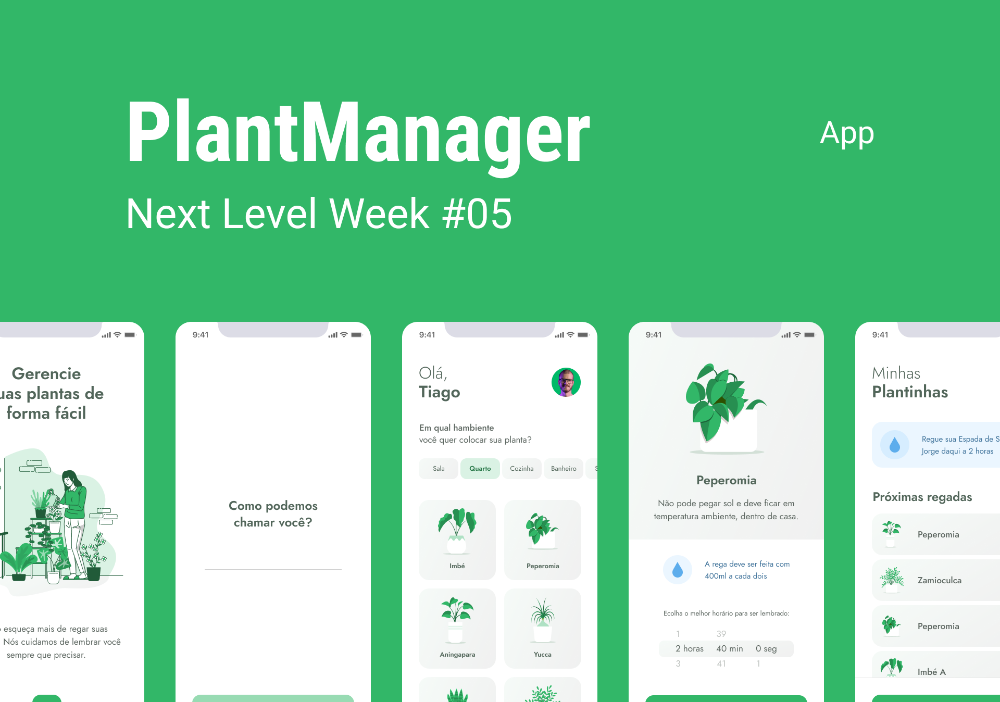

<h1 align="center" style="background-color: #FFF">
  
</h1>

<p align="center">
  <a href="#-tecnologias">Tecnologias</a>&nbsp;&nbsp;&nbsp;|&nbsp;&nbsp;&nbsp;
  <a href="#ℹ-como-usar">Como usar</a>&nbsp;&nbsp;&nbsp;|&nbsp;&nbsp;&nbsp;
  <a href="#-projeto">Projeto</a>&nbsp;&nbsp;&nbsp;|&nbsp;&nbsp;&nbsp;
  <a href="#-sobre">Sobre</a>&nbsp;&nbsp;&nbsp;|&nbsp;&nbsp;&nbsp;
  <a href="#-pendências-e-melhorias">Pendências e Melhorias</a>&nbsp;&nbsp;&nbsp;
  
</p>

<br>

<p align="center">
  
</p>

## 🚀 Tecnologias

Esse projeto foi desenvolvido com as seguintes tecnologias:

- [React Native](https://reactnative.dev/)
- [Expo](https://expo.io/)
- [Axios](https://github.com/axios/axios)
- [TypeScript](https://www.typescriptlang.org/)
- [AsyncStorage](https://react-native-async-storage.github.io/async-storage/)
- [Notifications](https://docs.expo.io/versions/latest/sdk/notifications/)
- [Json-Server](https://github.com/typicode/json-server)

## ℹ Como usar

Para clonar e executar este aplicativo, você precisará de [Git](https://git-scm.com), [Node.js](https://nodejs.org/en/), [Expo](https://expo.io/), [Json-Server](https://github.com/typicode/json-server) instalado no seu computador. Da sua linha de comando:

```bash
# Clone o repositório
$ git clone https://github.com/GustavCunha/PlantManager-1.0.git e cd plantmanager

# Instale as dependências
$ npm install ou yarn install

# Execute o aplicativo
$ expo start
```

## 💻 Projeto

O PlantManager é um app para lembrar sempre de regar as mudas das suas plantas

## 📜 Sobre

Este é um projeto desenvolvido durante a **[Next Level Week](https://nextlevelweek.com/)**, apresentado por **[@Rocketseat](https://github.com/Rocketseat)** de 19 a 25 de abril de 2021. <br/>
Através desse treinamento da Rocketseat, pude aprender novos aspectos do React Native e pretendo criar novas funcionalidades neste app, ou a partir do mesmo elaborar novas ideias para um projeto futuro!

## 📌 Pendências e Melhorias
- [ ] Melhorar confirmação de exclusão da Planta
- [ ] Criar a funcionalidade para horário de notificação das plantas
- [ ] Permitir incluir uma imagem de perfil
- [ ] Fazer deploy do App
